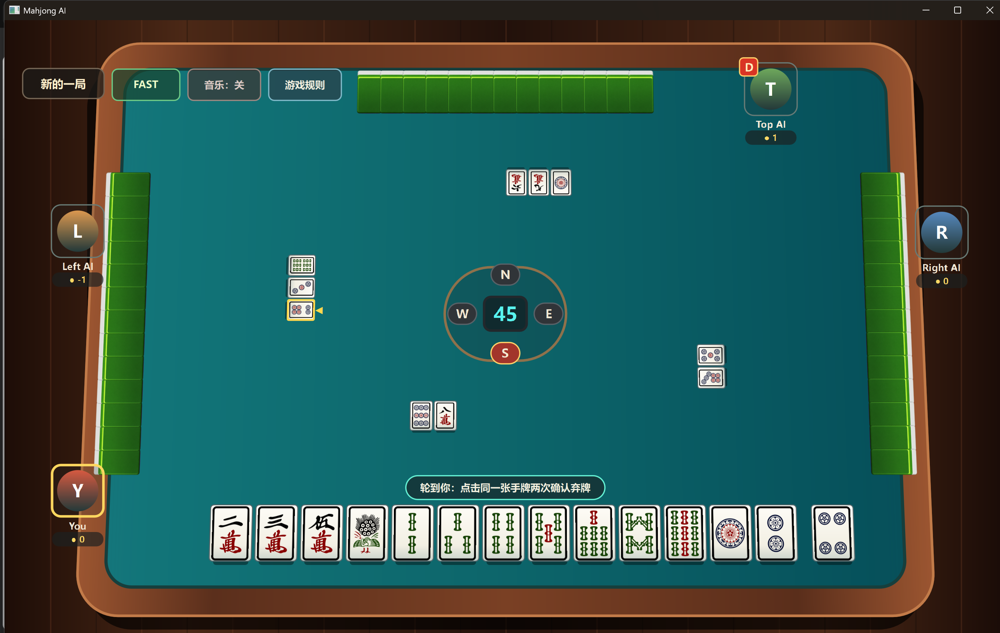

# mahjong_ai

## 单机四人对局

真人玩家可以在桌面界面中与三个本地 AI 完成整局麻将：



项目需要 Python 3.11 或更高版本。请在项目根目录执行以下命令。

### Windows PowerShell

```powershell
py -3 -m venv .venv
& .\.venv\Scripts\Activate.ps1
python -m pip install -e ".[ui,test]"
python -m mahjong_ai play
```

### macOS Terminal

```bash
python3 -m venv .venv
source .venv/bin/activate
python -m pip install -e ".[ui,test]"
python -m mahjong_ai play
```

macOS、Windows 在激活虚拟环境后都可以直接使用本文后续的 `python -m mahjong_ai ...` 命令。桌面依赖会安装 PySide6 Essentials 和 Addons，后者用于播放背景音乐。程序优先加载 `assets/music/background music.wav`，没有 WAV 时自动回退到同名 MP3。

人类玩家固定为“自己”座位，三个 AI 使用相互独立的策略实例和不同随机 seed。每个 AI 只能读取自己的手牌和公开牌局信息，不能访问其他玩家暗手、真实牌墙顺序或未来摸牌。界面同样只显示人类玩家有权看到的信息。

当前游戏界面使用 PySide6 Qt Quick/QML，提供：

- 俯视麻将桌、三家立体牌背、真实 SVG 牌面、四家弃牌河和副露区；
- 自动摸牌和 AI 自动行动，AI 行动速度可调；
- 第一次点击手牌进行选择，第二次点击同一张牌确认弃牌；
- 根据 `legal_actions()` 只显示当前合法的胡、碰、杠和过；
- 最新弃牌标记，以及被碰或明杠使用后的变暗显示；
- 背景音乐循环播放和“音乐：开/关”按钮；
- “游戏规则”按钮，可查看精简的基本规则和计分规则；
- “新的一局”按钮，每局重新随机庄家并保留四家累计积分。

所有摸牌、弃牌、碰、杠、胡牌和结算都通过 `GameSession → MahjongEnvironment.legal_actions()/step()` 完成，QML 不直接修改手牌、牌墙或分数。

### 当前计分摘要

- 普通点炮：胡牌者 `+1`，点炮者 `-1`；庄家胡牌翻倍。
- 普通自摸：其他三家各 `-2`，胡牌者共 `+6`；庄家胡牌翻倍。
- 暗杠 `+2`，明杠 `+1`，补杠 `+1`。
- 当前单机游戏四家炮子数固定为 `0`。

完整规则见 [`rules.markdown`](rules.markdown)。

## 基础安装与牌码

如果只使用核心算法和测试，在已经激活的虚拟环境中安装：

```console
python -m pip install -e ".[test]"
```

牌码中的 `w`、`s`、`p` 分别表示万、条、筒，例如 `1w` 是一万、`6s` 是六条、`9p` 是九筒。命令行也接受中文后缀。可使用 `--visible` 传入已经看见的弃牌或副露牌：

```console
python -m mahjong_ai "1w 2w 3w 4w 5w 6w 2s 3s 4s 5p 5p 5p 8p 8p" --visible "1w 1w 9p"
```

以下为各个版本提交介绍：

## v0.1 核心手牌分析

建立 27 种牌的整数编码和长度为 27 的手牌计数结构，实现普通平胡的向听数、听牌、有效牌、剩余张数及候选弃牌排名。核心算法与命令行解耦，并由 pytest 覆盖基础牌型和边界情况。

命令行分析示例：

```console
python -m mahjong_ai "1w 2w 3w 4w 5w 6w 2s 3s 4s 5p 5p 5p 8p 8p"
```

## v0.2 副露手牌分析

增加 `Meld` 和碰、明杠、暗杠、补杠数据结构。向听数、胡牌判断和弃牌推荐可以接收固定面子数量，因此能分析已经存在副露的手牌；杠在胡牌结构中只算一组完成面子。

## v0.3 状态引擎

`mahjong_ai.state` 提供只记录公开信息的四人牌局状态引擎，支持：开局、设置自己的初始手牌、摸牌、弃牌、碰、明杠、暗杠、补杠、胡牌、轮转与撤销。

状态引擎提供持续运行的交互式命令行。启动它：

```console
python -m mahjong_ai game
```

输入 `help` 查看所有事件命令；使用 `status` 查看状态，轮到 `SELF` 时输入 `analyze` 获取向听、听牌、有效牌和弃牌推荐。输入 `undo` 撤销上一个事件，`quit` 退出。

一个最小流程（庄家为自己）：

```text
start self
hand 1w 2w 3w 4w 5w 6w 7w 8w 9w 2s 2s 2s 5p 9p
analyze
discard self 5p
next self
hidden-draw right
discard right 9p
```

副露命令示例：`peng right self 3w`、`exposed-gang left right 5p`、`concealed-gang self 7s`、`added-gang self 7s`。所有命令都会通过状态引擎验证轮次、牌数和公开牌数量。

## v0.4 桌面录入界面

安装桌面界面可选依赖后启动：

```console
python -m pip install -e ".[ui,test]"
python -m mahjong_ai ui
```

界面使用 PySide6，提供四家独立的弃牌河与副露区、排序后的自己的手牌、分析面板，以及新一局、撤销、保存和加载按钮。当前行动玩家以蓝色边框和浅蓝背景标识；最后一张仍可响应的弃牌会显示 `【最后】`，不再使用影响文字可读性的黄色高亮。

界面会自动根据当前状态引导下一步，因而无需反复选择玩家和动作：自己出牌时直接点击手牌；其他玩家出牌时点击下方牌面；其他玩家摸牌时只需点击“记录暗摸”。弃牌后仅显示当前可用的碰、明杠、胡和“无人响应，下一家”按钮。所有界面操作都会转换为 `GameEvent` 后再由状态引擎验证和更新。

运行状态引擎测试：

```console
python -m pytest tests/test_state_engine.py -q
```

最小 API 用法：

```python
from mahjong_ai.state import (
    CallPeng,
    DiscardTile,
    PlayerPosition,
    SetOwnInitialHand,
    StartRound,
    apply_event,
    new_game,
)
from mahjong_ai.tiles import tile_to_code

self_ = PlayerPosition.SELF
right = PlayerPosition.RIGHT

state = apply_event(new_game(), StartRound(self_))
initial_tiles = (
    [tile_to_code("1w")]
    + [tile_to_code("2w")] * 4
    + [tile_to_code("3w")] * 4
    + [tile_to_code("4w")] * 4
    + [tile_to_code("5w")]
)
state = apply_event(state, SetOwnInitialHand(tuple(initial_tiles)))
state = apply_event(state, DiscardTile(self_, tile_to_code("1w")))
state = apply_event(state, CallPeng(right, tile_to_code("1w"), self_))

assert state.visible_counts[tile_to_code("1w")] == 3
```

上例中，自己的 `1w` 被 RIGHT 碰走后，弃牌河中的那张会标记为已使用；公开牌中 `1w` 总数为 3，不会被重复统计为“弃牌 1 张 + 碰牌 3 张”。

## v0.5 全知模拟与数据集

自动模拟器使用与项目一致的 108 张三门牌、平胡、碰和四种杠规则。它保存完整暗手、牌墙和逐步快照，但策略只能收到自己的手牌与公开观察。

生成全知 JSONL 牌谱：

```console
python -m mahjong_ai simulate --games 10000 --seed 42 --output data/full_games.jsonl
```

从牌谱提取公开特征与隐藏标签：

```console
python -m mahjong_ai build-dataset --input data/full_games.jsonl --output data/bayes_samples.jsonl
```

样本在“摸牌后弃牌前”和“弃牌后响应前”提取。每条输入只含观察者手牌与公开桌面信息；目标玩家的向听、听牌和危险牌掩码只作为隐藏标签。目标处于 14 张弃牌状态时，危险牌掩码全为假，不假设其未来会弃哪一张牌。

## v0.6 公开信息对手风险模型

v0.6 从 v0.5 产生的全知牌谱训练可解释的朴素贝叶斯模型。模型只使用实战中可见的公开信息，输出每种合法弃牌对三家的**模型估计放炮概率**，以及任意一家放炮的综合概率；它不会宣称为真实或精确概率，也不会把风险混入牌效率推荐。

综合概率采用条件独立近似：`1 - product(1 - opponent_risk)`。三个对手的听牌状态和等待牌并非真正独立，因此该值只能作为模型估计。

训练与预测：

```console
python -m mahjong_ai train-opponent-model --input data/bayes_samples.jsonl --output models/opponent_risk_v1.json
python -m mahjong_ai predict-discard-risk --model models/opponent_risk_v1.json --state data/example_observation.json
```

`--state` 是一个 JSON 格式的 `Observation`：包含自己的 27 位计数手牌、公开弃牌/副露、公开牌计数、各家暗牌张数、当前玩家和阶段。预测只在“自己摸牌后、自己当前可弃牌”的状态输出候选牌。每种牌仅输出一次，并注明手中张数。输出中的三家综合风险明确为条件独立近似。

## v0.7 强化学习弃牌训练

v0.7 的训练环境只让 RL 模型决定自己的弃牌；三家对手和自己的非弃牌动作均使用内部随机合法策略，不将贝叶斯风险模型作为训练特征或奖励。可先用现有规则弃牌策略生成行为克隆示范，让网络从规则模型开始，再进行 RL 微调；规则策略不会成为训练对手。模拟器按 `rules.markdown` 记录点炮、自摸、庄家胡牌翻倍、暗杠/放杠/补杠与 0–4 炮子分；RL 训练和评测默认将四家炮子固定为 0。训练完成后会用同一组固定种子，将 RL 模型与原有规则弃牌策略分别对阵随机对手，并把平均分、胜率、流局率、放炮率写入报告。

安装训练依赖后再由用户手动开始训练：

```console
python -m pip install -e ".[rl]"
python -m mahjong_ai train-rl --episodes 50000 --pretrain-games 5000 --seed 42 --output models/rl_discard_v1.json --report artifacts/rl_discard_v1_report.json --eval-games 1000
python -m mahjong_ai evaluate-rl --model models/rl_discard_v1.json --games 5000 --seed 2026
```

强化学习目前训练效果还不好。

## v1.0 单机四人游戏

增加 `GameSession`、`HumanPlayer` 和独立的 `AIPlayer` 适配层，形成一名人类对战三名本地 AI 的完整单局流程。三个 AI 使用不同随机 seed，只能从各自的 `Observation` 选择合法动作，不能共享或读取隐藏信息。新增 `python -m mahjong_ai play` 游戏入口。

## v1.1 麻将桌组件与 SVG 牌面

将表单式窗口改造成四人麻将桌布局，加入手牌、弃牌河、副露区、行动转盘和圆形操作按钮。接入万、条、筒共 27 张 SVG 牌面及站立牌背素材，并在 `THIRD_PARTY_ASSETS.md` 中记录素材来源与许可证。

## v1.2 Qt Quick/QML 视觉原型

引入 Qt Quick/QML，使用可缩放的桌面场景、SVG 正面牌和 2.5D 预渲染牌背搭建麻将桌视觉原型，为后续动画、响应式布局和正式游戏状态接入奠定基础。

## v1.3 牌桌视觉方案验证

尝试 QGraphicsView、背景图和左右方向专用牌背等方案，并继续完善 QML 中的四家弃牌河、玩家信息区和中央行动转盘。最终正式游戏继续采用 QML，实验入口保留用于视觉调试。

## v1.4 可玩的 QML 游戏界面

通过 `GameBridge` 将 QML 与 `GameSession` 连接，界面直接渲染公开状态，所有操作仍经 `legal_actions()` 和 `step()` 执行。实现自动摸牌、AI 定时行动、两次点击确认弃牌、合法的胡碰杠过按钮、副露显示、最终结算、最新弃牌标记、循环背景音乐和跨局累计积分。

## v1.5 交互与布局优化

完善动作按钮顺序、重复牌的单张选择、无操作时自动跳过和手牌提示。自己的手牌会根据副露占用空间动态调整位置，避免与左右玩家或自己的碰杠区重叠；同时增加音乐开关并优化玩家信息和状态提示位置。

## v1.6 游戏规则弹窗

增加“游戏规则”按钮，在游戏内展示精简的基本规则和计分规则。弹窗只读取固定说明文字，不修改游戏状态；完整规则仍以 [`rules.markdown`](rules.markdown) 为准。

## v1.7 文档整理

补充当前单机游戏的安装、启动、操作、信息隔离、计分和界面功能说明，并整理从核心分析算法到完整 QML 单机游戏的版本演进记录。

## 测试

运行全部测试：

```console
python -m pytest
```

测试覆盖核心牌型算法、公开状态引擎、模拟器牌数守恒、日志重放、数据集、风险模型、RL 环境、AI 信息隔离、游戏控制层和 QML 离屏启动。

本项目是纯 Python 的简化麻将分析、牌局状态、自动模拟和单机四人对局项目。仅使用万、条、筒 27 种牌，按 `4 面子 + 1 将` 判断胡牌；不使用网页技术，也不计算特殊牌型。
